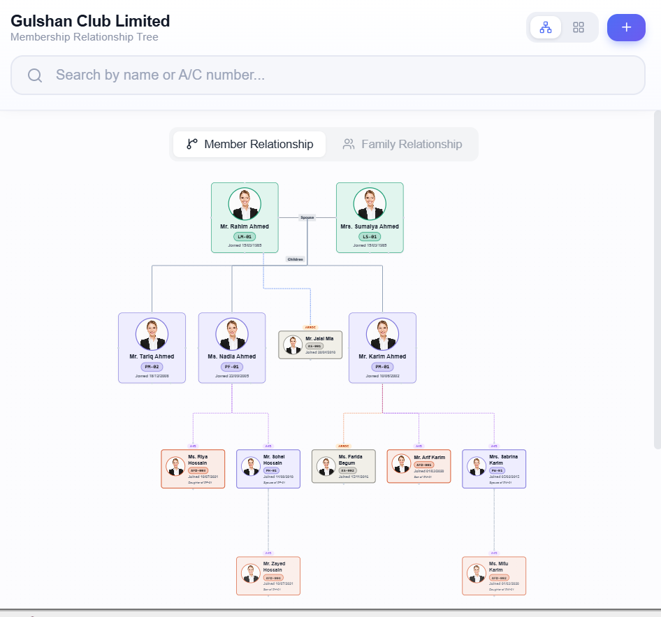

# 🌳 Gulshan Club — Membership Relationship Tree

A production web application built for **Gulshan Club Limited, Dhaka**.

## 🔗 Live Demo
**[👉 Click here to view demo](https://gcl-member-relationship-tree-lryzfe1d3.vercel.app)**

## 🛠 Tech Stack
Next.js 14 · TypeScript · React Flow · Dagre · Zustand · Supabase · Prisma · Vercel

## ✨ Features
- Interactive family tree (zoom, pan, drag)
- Member & Family Relationship diagrams
- Search, Filter, Grid view
- Photo upload & management
- Mobile responsive

>## Preview
